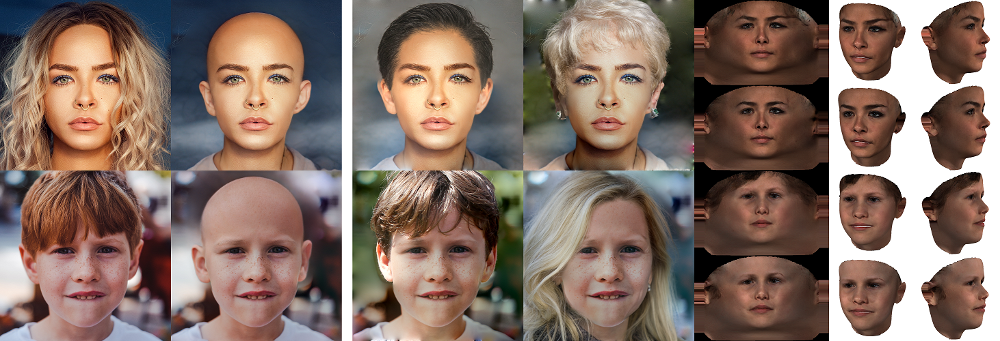

# Removing Hair from Portraits Using GANs



## License

**You can use, redistribute, and adapt this software for NON-COMMERCIAL purposes only**.

## Demo

 [](https://colab.research.google.com/github/oneThousand1000/HairMapper/blob/master/notebooks/HairMapper.ipynb)


## Requirements

1. Windows (not tested on Linux yet)
2. Python 3.7
3. NVIDIA GPU + CUDA11.1 + CuDNN


## Reference and Acknowledgements

We thanks the following works:

[stylegan2-ada-pytorch](https://github.com/NVlabs/stylegan2-ada-pytorch)

[StyleCLIP](https://github.com/orpatashnik/StyleCLIP)

[encoder4editing](https://github.com/omertov/encoder4editing)

[InterFaceGAN](https://github.com/genforce/interfacegan)

[idinvert](https://github.com/genforce/idinvert)

```
@InProceedings{Patashnik_2021_ICCV,
    author    = {Patashnik, Or and Wu, Zongze and Shechtman, Eli and Cohen-Or, Daniel and Lischinski, Dani},
    title     = {StyleCLIP: Text-Driven Manipulation of StyleGAN Imagery},
    booktitle = {Proceedings of the IEEE/CVF International Conference on Computer Vision (ICCV)},
    month     = {October},
    year      = {2021},
    pages     = {2085-2094}
}
@inproceedings{zhu2020indomain,
  title     = {In-domain GAN Inversion for Real Image Editing},
  author    = {Zhu, Jiapeng and Shen, Yujun and Zhao, Deli and Zhou, Bolei},
  booktitle = {Proceedings of European Conference on Computer Vision (ECCV)},
  year      = {2020}
}
@inproceedings{shen2020interpreting,
  title     = {Interpreting the Latent Space of GANs for Semantic Face Editing},
  author    = {Shen, Yujun and Gu, Jinjin and Tang, Xiaoou and Zhou, Bolei},
  booktitle = {CVPR},
  year      = {2020}
}
@article{tov2021designing,
  title={Designing an Encoder for StyleGAN Image Manipulation},
  author={Tov, Omer and Alaluf, Yuval and Nitzan, Yotam and Patashnik, Or and Cohen-Or, Daniel},
  journal={arXiv preprint arXiv:2102.02766},
  year={2021}
}
@inproceedings{Karras2020ada,
  title     = {Training Generative Adversarial Networks with Limited Data},
  author    = {Tero Karras and Miika Aittala and Janne Hellsten and Samuli Laine and Jaakko Lehtinen and Timo Aila},
  booktitle = {Proc. NeurIPS},
  year      = {2020}
}
```

